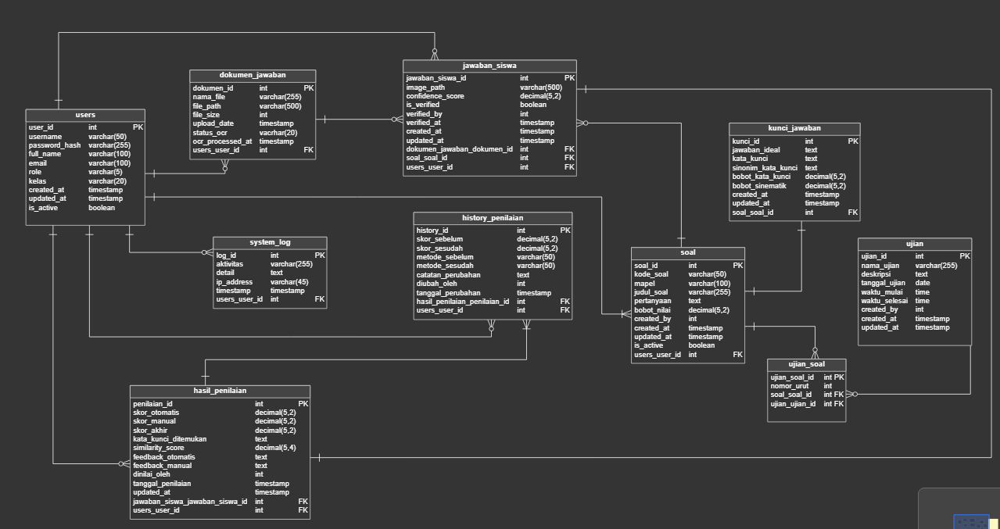

> Note: frontend backend folder dipisah, kalau mau push usahakan buat branch dulu. thankyou

# 📚 AutoEssayGrader

Sistem otomatis untuk mengoreksi esai dari dokumen PDF yang di-scan menggunakan teknologi Computer Vision dan Natural Language Processing (NLP).

## 📋 Deskripsi Proyek

AutoEssayGrader adalah proyek ambisius yang menggabungkan dua bidang utama dalam kecerdasan buatan:

- **Computer Vision**: untuk membaca dan memproses dokumen scan
- **Natural Language Processing (NLP)**: untuk memahami dan menilai jawaban esai

Proyek ini bertujuan untuk mengotomatisasi proses penilaian esai, sehingga dapat membantu guru dan dosen dalam mengevaluasi hasil ujian secara efisien dan objektif.

## 👥 Tim Pengembang

| Divisi       | Anggota Tim                      | Peran     |
| ------------ | -------------------------------- | --------- |
| **Frontend** | Muhammad Azhar Aziz              | Developer |
|              | Christoforus Indra Bagus Pratama | Developer |
|              | Nadin Nabil Hafizh Ayyasy        | Developer |
| **AI**       | Choirul Anam                     | Leader    |
|              | Rachmat Ramadhan                 | Developer |
|              | Muh. Buyung Saloka               | Developer |
| **Backend**  | Pramuditya Faiz Ardiansyah       | Developer |
|              | Alvin Zanua Putra                | Developer |

## Jangan lupa dibaca sebelum menjalankan project 

- Dokumentasi Frontend
[README FRONTEND](./frontend/README.md)

- Dokumentasi Backend
[README BACKEND](./backend/README.md)

___

`Link :`
Auto Essay Grader :

ChatGPT Plan link :
https://chatgpt.com/s/t_68c25df0b4d481918f26bf821ca5fd33

Google Docs :
https://docs.google.com/document/d/1vms94zZRo3TJiUYD1jylkX96dGxxhhQvzSsU_vtxY7Q/edit?tab=t.0

Presentation :
https://www.canva.com/design/DAGyo2F2VTY/03xeYdHJ3KUiXQSAA3H_7w/edit?utm_content=DAGyo2F2VTY&utm_campaign=designshare&utm_medium=link2&utm_source=sharebutton

UI/UX :
https://www.figma.com/design/ngNgLE9BB88A86hhdc6yfv/website-pbkk?node-id=0-1&t=MLaL2GhwywC9tzRw-1

Link GitHub Project :
https://github.com/alvinzanuaputra/AutoEssayGrader

___

`PDM`

`catatan rencana awal`
[klik](./databases/autoessay.sql)

`export dari vertabello`
[klik](./databases/pbkk__create_vertabello.sql)

___